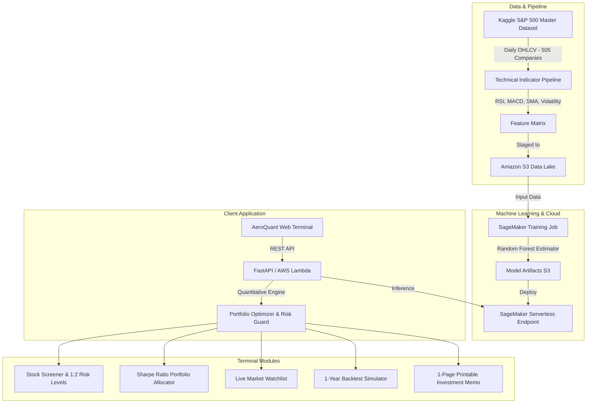

# 📈 AeroQuant | Quantitative Stock Intelligence & Portfolio Risk Engine

An end-to-end quantitative financial analytics platform combining **Random Forest machine learning**, **technical indicators (RSI, MACD, Moving Averages)**, **Modern Portfolio Theory (Sharpe Ratio)**, and **AWS Cloud Architecture (EC2, S3, Lambda, API Gateway)**.

---

## 🌐 Live Cloud Deployment Links

| Resource | URL / Access | Description |
| :--- | :--- | :--- |
| **Live Web Terminal (HTTPS)** | **[https://investor-councils-norman-vary.trycloudflare.com](https://investor-councils-norman-vary.trycloudflare.com)** | Secure SSL production link |
| **AWS EC2 Public Domain** | **[http://ec2-100-48-83-175.compute-1.amazonaws.com](http://ec2-100-48-83-175.compute-1.amazonaws.com)** | Official Amazon AWS instance link |
| **AWS API Gateway** | `https://kfc073dfuj.execute-api.us-east-1.amazonaws.com` | Serverless ML inference API |
| **Amazon S3 Data Lake** | `s3://aeroquant-market-data-992483130712/` | Kaggle S&P 500 Unified Dataset (`all_stocks_5yr.csv`) |

---

## 🏗️ Architecture



---

## 🌟 Key Features

1. **Random Forest Trend Predictor:** Uses an intuitive committee of 100 decision trees to forecast 5-day market momentum with probability confidence scores.
2. **Dynamic Risk-Reward Management:** Automatically calculates **Stop-Loss** and **Take-Profit Target Prices** (1:2 ratio) to protect capital.
3. **Multi-Stock Portfolio Optimizer:** Implements Markowitz Modern Portfolio Theory to calculate optimal capital allocation weights for 3–5 stocks based on maximum Sharpe Ratio.
4. **1-Page Printable Investment Memo:** Generates a formal, printable executive investment summary for any selected stock.
5. **Strategy Backtester:** Simulates 1-year historical trading performance of the ML strategy against the standard Buy & Hold benchmark.
6. **Market Watchlist:** Real-time prices, 24h change %, and instant momentum badges for top market leaders.

---

## 🚀 Quickstart: Run Locally in 2 Steps

### 1. Install Dependencies
```bash
pip install -r requirements.txt
```

### 2. Start the Terminal
```bash
python server.py
```
Open your browser and navigate to: **`http://localhost:5000`**

*(On the first launch, the app automatically fetches market data and trains the Random Forest model in seconds.)*

---

## 📁 Repository Structure
```text
├── data/
│   └── all_stocks_5yr.csv       # Kaggle S&P 500 unified master dataset (505 companies, 619,040 rows)
├── models/
│   ├── stock_rf_model.joblib    # Trained Random Forest model (100 Trees)
│   └── metrics.json             # Accuracy (55.4%), Precision (58.1%), F1 (58.4%)
├── frontend/
│   └── index.html              # Modern dark financial terminal (Tailwind CSS, Chart.js)
├── code/
│   ├── data_loader.py           # S&P 500 master dataset pipeline & technical indicators
│   ├── train_model.py           # Random Forest training and evaluation script
│   ├── quant_engine.py          # Risk levels, Sharpe portfolio optimizer & backtester
│   ├── server.py                # FastAPI server (Interactive Swagger docs at /docs)
│   ├── lambda_function.py       # AWS Lambda inference handler script
│   └── train_sagemaker.py       # AWS SageMaker & Amazon S3 data lake staging
├── requirements.txt             # Python dependencies (FastAPI, Uvicorn, Scikit-Learn)
├── README.md                    # Project documentation
└── VIVA_GUIDE.md                # Teacher Viva Questions & Answers
```
