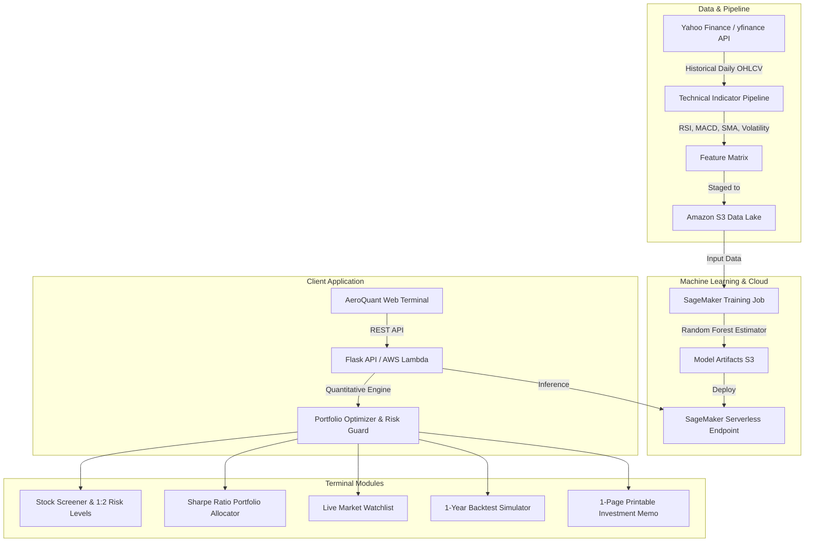

# 📈 AeroQuant | Quantitative Stock Intelligence & Portfolio Risk Engine

An end-to-end quantitative financial analytics platform combining **Random Forest machine learning**, **technical indicators (RSI, MACD, Moving Averages)**, **Modern Portfolio Theory (Sharpe Ratio)**, and **AWS SageMaker cloud deployment**.

---

## 🏗️ Architecture



---

## 🌟 Key Features

1. **Random Forest Trend Predictor:** Uses an intuitive committee of 100 decision trees to forecast 5-day market momentum with probability confidence scores.
2. **Dynamic Risk-Reward Management:** Automatically calculates **Stop-Loss** and **Take-Profit Target Prices** (1:2 ratio) to protect capital.
3. **Multi-Stock Portfolio Optimizer:** Implements Markowitz Modern Portfolio Theory to calculate optimal capital allocation weights for 3–5 stocks based on maximum Sharpe Ratio.
4. **1-Page Printable Investment Memo:** Generates a formal, printable executive investment summary for any selected stock.
5. **Strategy Backtester:** Simulates 1-year historical trading performance of the ML strategy against the standard Buy & Hold benchmark.
6. **Market Watchlist:** Real-time prices, 24h change %, and instant momentum badges for top market leaders.

---

## 🚀 Quickstart: Run Locally in 2 Steps

### 1. Install Dependencies
```bash
pip install -r requirements.txt
```

### 2. Start the Terminal
```bash
python server.py
```
Open your browser and navigate to: **`http://localhost:5000`**

*(On the first launch, the app automatically fetches market data and trains the Random Forest model in seconds.)*

---

## 📁 Repository Structure
```text
├── data/                       # Cached market datasets for offline execution
├── models/                     # Trained Random Forest model and evaluation metrics
├── frontend/
│   └── index.html              # Modern dark financial terminal (Tailwind CSS, Chart.js)
├── data_loader.py              # Yahoo Finance data pipeline & technical indicator calculator
├── train_model.py              # Random Forest training and evaluation script
├── quant_engine.py             # Risk levels, portfolio optimizer, backtester & memo generator
├── train_sagemaker.py          # AWS SageMaker Scikit-learn Estimator script
├── lambda_function.py          # AWS Lambda inference handler script
├── server.py                   # Flask API server
├── requirements.txt            # Python dependencies
├── README.md                   # Project documentation
└── VIVA_GUIDE.md               # Teacher Viva Questions & Answers
```
